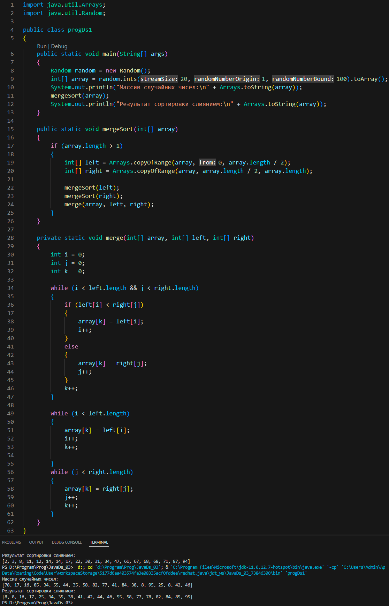
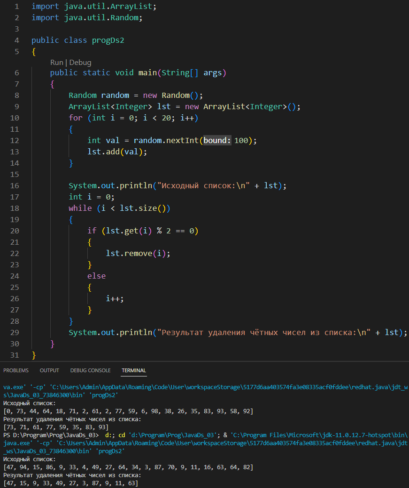
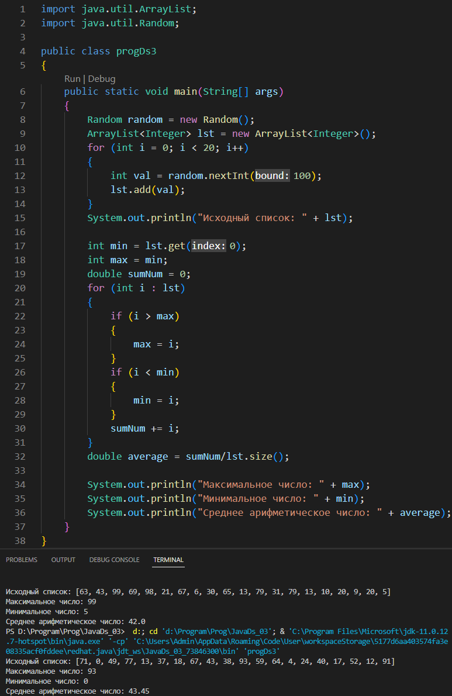

# Урок 3. Коллекции JAVA: Введение

## Задание 1
### Реализовать алгоритм сортировки слиянием.

## Задание 2
### Пусть дан произвольный список целых чисел, удалить из него четные числа.

## Задание 3
### Задан целочисленный список ArrayList. Найти минимальное, максимальное и среднее из этого списка.
